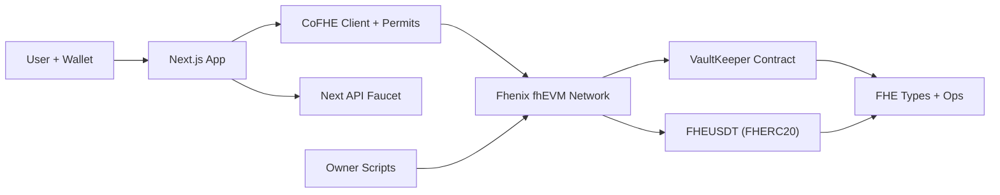

# VaultKeeper — Private Yield Vaults
Your Yield. Your Balance. Your Edge.

VaultKeeper is a privacy-first DeFi yield platform where deposits, balances, rewards, and TVL remain encrypted on-chain using Fhenix Fully Homomorphic Encryption (FHE). Users earn yield in risk-based vaults without exposing financial behavior on public ledgers.

Built for the Fhenix Privacy-by-Design dApp Buildathon.

## Documentation
- **Why VaultKeeper**: The problem, the privacy gap in DeFi, and why now
- **How It Works**: Full walkthrough from deposit to withdraw
- **FHE Explained**: What Fully Homomorphic Encryption is
- **Architecture**: System design and component overview
- **Privacy Model**: Exactly what is hidden and what is not
- **Smart Contracts**: Full contract reference
- **Economics**: Vault APY bands and reward math
- **Security**: Threat model and mitigations
- **Deployment**: Step-by-step deploy guide
- **Roadmap**: V1 → V5 and beyond
- **FAQ**: Questions from users, developers, investors


## What Makes VaultKeeper Different

Standard DeFi vault:
```
deposit(vaultId, amount=1000 USDT)
→ user balance stored: 1000  ← anyone can read this
```

VaultKeeper:
```
encrypt(amount=1000 USDT) → 0x8ab1... (FHE ciphertext)
deposit(vaultId, 0x8ab1...)
→ balance stored: 0x8ab1...  ← computationally opaque
```

The contract computes on encrypted state using `FHE.add()`, `FHE.sub()`, and `FHE.select()` — never decrypting individual balances. The Fhenix FHE network guarantees correctness of computation on ciphertext.

## Stack

| Layer | Technology |
|---|---|
| Smart contracts | Solidity 0.8.x + @fhenixprotocol/contracts |
| FHE types | `euint64` (amounts), `ebool` (checks) |
| Network | Arbitrum Sepolia / Base Sepolia (CoFHE) |
| Frontend | Next.js, TypeScript, Tailwind CSS |
| Wallet | Wagmi v2 |
| Client FHE | @cofhe/sdk (CoFHE) |

---

## Product Overview

VaultKeeper is a privacy-first DeFi yield platform built on Fhenix FHE. Users deposit into risk-based vaults, earn yield,
and manage positions while balances, deposits, rewards, and TVL remain encrypted on-chain.

The repository contains:
- Smart contracts (`FHEVaultKeeper`, `FHEUSDT` confidential token)
- Hardhat deployment + owner operation scripts
- A Next.js frontend for encrypted vault UX (Vaults, Profile, Admin, Analytics)

### Core Features

**User Features**
- Browse risk-based vaults without exposing user balances
- Deposit and withdraw with encrypted balances
- Claim rewards while keeping values private
- View decrypted balances and rewards in the UI only

**Admin Features**
- Set platform reward token
- Create vaults dynamically (`name`, `risk`, `APY`, `token`)
- Update APY bands per vault
- Toggle vault active/paused status
- Emergency withdraw for vault operations

**Product UX Features**
- Dedicated pages (`/vaults`, `/profile`, `/admin`, `/analytics`)
- Wallet-aware admin gating (admin actions appear only for owner wallet)
- Modal-driven transactional actions (deposit/withdraw/claim/admin actions)
- Success toasts + confetti feedback on successful operations
- Filtering/search/sort in vault listings (name, risk, APR, TVL)

## Architecture & Functionality (Fhenix fhEVM Showcase)

This section maps every major feature to its Fhenix FHE usage so the full application surface area is easy to evaluate.

### Architecture Diagram



### Encrypted Data Lifecycle (End-to-End)
1. User enters an amount in the UI and the CoFHE client encrypts it with Fhenix keys.
2. The user grants a permit that allows confidential transfers to the vault contract.
3. The encrypted amount is sent to the fhEVM and processed with FHE ops (`FHE.add`, `FHE.sub`, `FHE.select`, `FHE.mul`, `FHE.div`).
4. Encrypted balances and TVL are stored on-chain as `euint64` values (never decrypted on-chain).
5. The UI locally decrypts values for the user only.

### Functional Coverage Map

**User Flows**
- **Deposit**: Encrypted input, confidential transfer into the vault, encrypted balance + TVL updates on-chain.
- **Withdraw**: Encrypted request, FHE-safe balance check, confidential transfer back to user.
- **Claim Rewards**: Yield computed via FHE math and transferred as confidential token.
- **Compound**: UI-only flow that claims rewards then deposits again when reward token matches vault token.
- **Private Portfolio View**: Decrypts user deposit, pending rewards, and vault TVL client-side only.

**Admin / Owner Flows**
- **Create Vaults**: Set name, risk, APY band, and confidential token.
- **Set Reward Token**: Defines which FHERC20 is used for rewards.
- **Update APY**: Change APY bands without revealing depositor data.
- **Toggle Vault Active**: Pause/unpause a vault.
- **Emergency Withdraw**: Owner-only drain using encrypted balances.

**Analytics & UX**
- **Vault Analytics Page**: Aggregated stats (active vaults, depositor counts, TVL trends) from encrypted state.
- **FHE-USDT Faucet**: On-chain mint endpoint for demo/testing.
- **Network Guardrails**: Base Sepolia + Arbitrum Sepolia wallet switching and RPC config.

### Where Fhenix FHE Appears (Exact Touch Points)
- On-chain encrypted math and types in `contracts/FHEVaultKeeper.sol`
- Confidential token via FHERC20 in `contracts/FHEUSDT.sol`
- CoFHE client config in `client/lib/cofhe-client.ts`
- CoFHE provider wiring in `client/contexts/cofhe-provider.tsx`
- Encrypt/decrypt helpers in `client/app/hooks/useCofheClient.ts`
- Encrypted vault flows + writes in `client/app/hooks/useVaultKeeper.ts`
- Encrypted UI rendering in `client/app/components/EncryptedValue.tsx`
- Scripted FHE deposit flow with permits in `scripts/vaultFHEDeposit.ts`

### Privacy Boundaries (What Stays Hidden)
- User deposits, balances, rewards, and vault TVL remain encrypted on-chain.
- Contracts perform arithmetic on ciphertext without ever revealing user amounts.
- Decryption happens only in the client for the connected wallet.

## Fhenix fhEVM + CoFHE Usage (Highlight)

This project relies on Fhenix FHE at every layer. Here is exactly where it shows up:

- On-chain encrypted math and types (`FHE.add`, `FHE.sub`, `euint64`, `ebool`) in `contracts/FHEVaultKeeper.sol`
- Confidential ERC-20 token built on Fhenix FHERC20 in `contracts/FHEUSDT.sol`
- CoFHE client initialization in `client/lib/cofhe-client.ts`
- CoFHE provider wiring in `client/contexts/cofhe-provider.tsx`
- Encrypt/decrypt helpers used by the app in `client/app/hooks/useCofheClient.ts`
- Encrypted vault flows and tx handling in `client/app/hooks/useVaultKeeper.ts`
- Encrypted value rendering in `client/app/components/EncryptedValue.tsx`

## Faucets and Test Funding

- Fhenix fhEVM faucet (external): use it to fund your wallet with test ETH for gas before running scripts or using the UI.
- In-app FHEUSDT faucet: a local/testnet mint endpoint at `client/app/api/faucet/usdt/route.ts`.
- UI entry points: “Mint FHE-USDT” buttons in `client/app/vaults/page.tsx` and `client/app/admin/page.tsx`.

## Network Configuration

Current target networks:
- Base Sepolia: Chain ID `84532`, RPC `https://sepolia.base.org`, Explorer `https://sepolia.basescan.org`
- Arbitrum Sepolia: Chain ID `421614`, RPC `https://sepolia-rollup.arbitrum.io/rpc`, Explorer `https://sepolia.arbiscan.io`

## Contract Addresses (Current)

Frontend currently points to:
- `VAULT_KEEPER_ADDRESS=0x075219E95666366499b66fBEeEd8e19B8F262272`
- `REWARD_TOKEN_ADDRESS=0x027358685B192d707cbD87c9bb3a08bc7dC04Ac9`

Update these in:
- `client/app/config/vault_config.ts`

## Owner Operation Scripts

### Deployment
- `npm run deploy:vault` - deploy VaultKeeper on testnet
- `npm run deploy:usdt` - deploy USDT and mint configured amount

### Vault Management
- `npm run vaults:status`
- `npm run vaults:set-reward-token`
- `npm run vaults:create`
- `npm run vaults:update-apy`
- `npm run vaults:toggle`
- `npm run vaults:emergency-withdraw`

### Ordered Owner Setup Flow
- `npm run owner:1:deploy`
- `npm run owner:2:set-reward-token`
- `npm run owner:3:create-stable`
- `npm run owner:4:create-growth`
- `npm run owner:5:create-turbo`
- `npm run owner:6:status`

## Required Environment Variables

At minimum (root `.env`):
- `PRIVATE_KEY`
- `POLKADOT_HUB_TESTNET_RPC_URL` (optional if using default)

For vault setup scripts:
- `REWARD_TOKEN_ADDRESS`
- `STABLE_VAULT_TOKEN_ADDRESS`
- `GROWTH_VAULT_TOKEN_ADDRESS`
- `TURBO_VAULT_TOKEN_ADDRESS`

Optional deploy controls:
- `INITIAL_OWNER_ADDRESS`
- `VAULT_KEEPER_ADDRESS` (override resolved deployment)
- `USDT_OWNER_ADDRESS`
- `USDT_MINT_TO`
- `USDT_MINT_AMOUNT`

## Local Development

### Contracts
```bash
npm install
npx hardhat compile
```

### Frontend
```bash
cd client
npm install
npm run dev
```

Open: `http://localhost:3000`

## Security Notes

- Do not commit production private keys
- Rotate keys immediately if exposed
- Restrict owner wallet usage to admin operations only
- Validate contract addresses before running owner scripts

## Product Status

VaultKeeper is structured as a full product stack (contracts + operational scripts + role-aware frontend), not a prototype dashboard.
